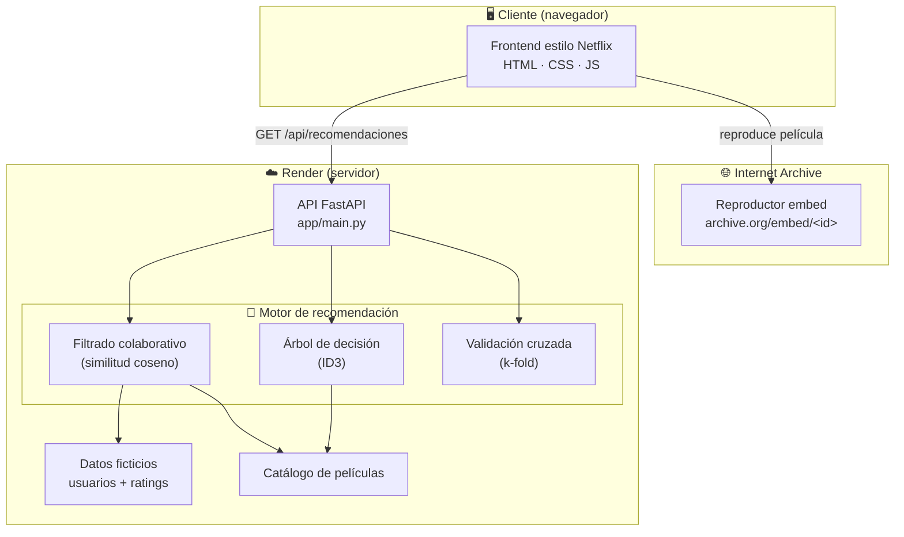
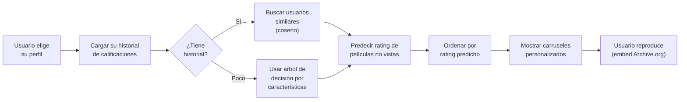
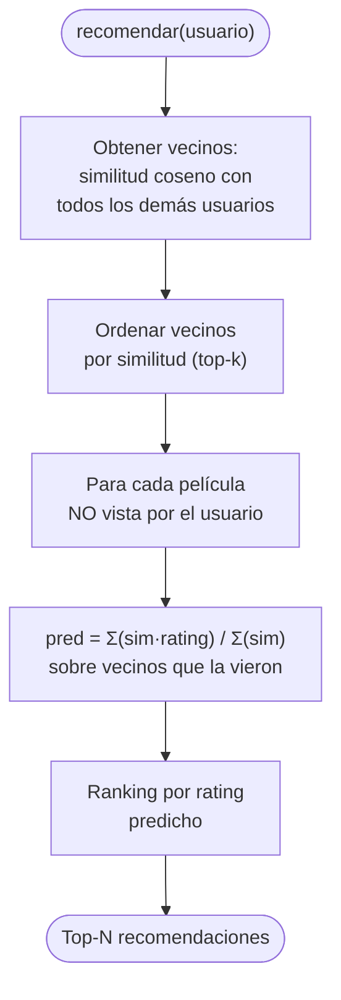
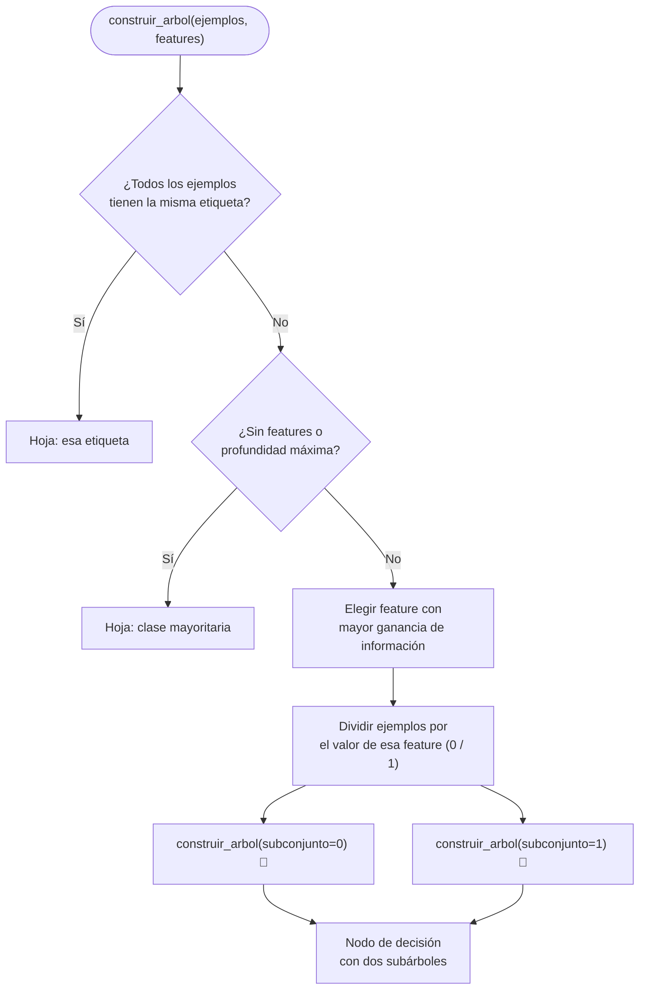
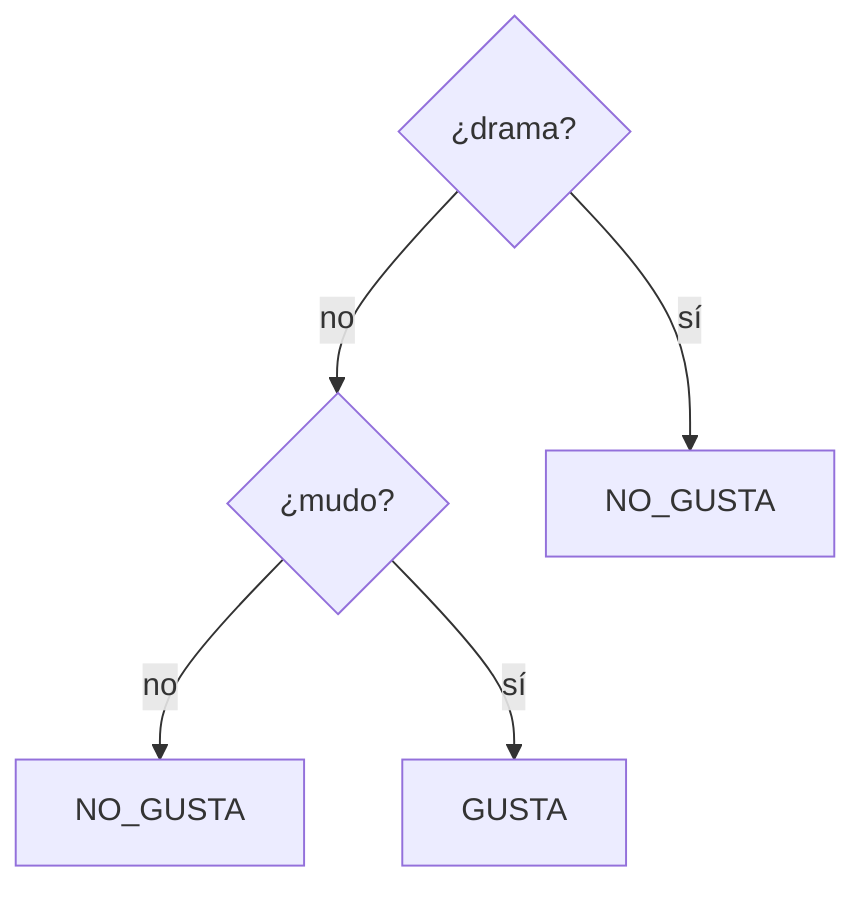

# Diagramas del sistema StreamFlix

Diagramas en formato **Mermaid** (se renderizan automáticamente en GitHub y en
editores compatibles). Cada uno acompaña una parte de la propuesta.

---

## 1. Arquitectura general

---

## 2. Flujo del proceso de recomendación

---

## 3. Algoritmo de filtrado colaborativo

---

## 4. Construcción recursiva del árbol de decisión (ID3)

---

## 5. Ejemplo de árbol aprendido (usuario "Fan del terror clásico")

> Este árbol se genera dinámicamente desde el endpoint `/api/arbol/{usuario_id}`.
> La estructura concreta cambia según el historial de cada usuario.
